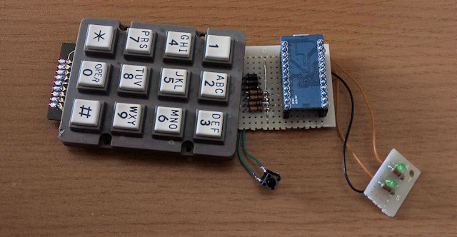
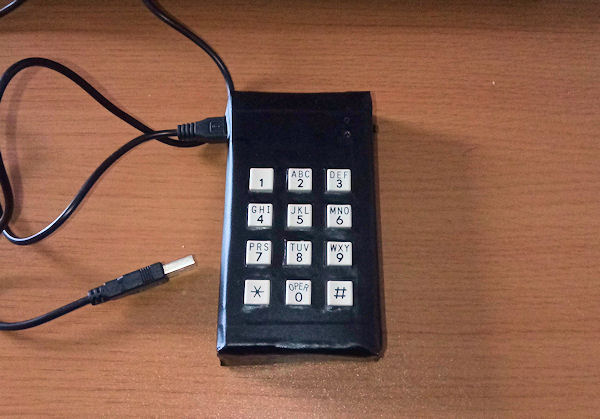
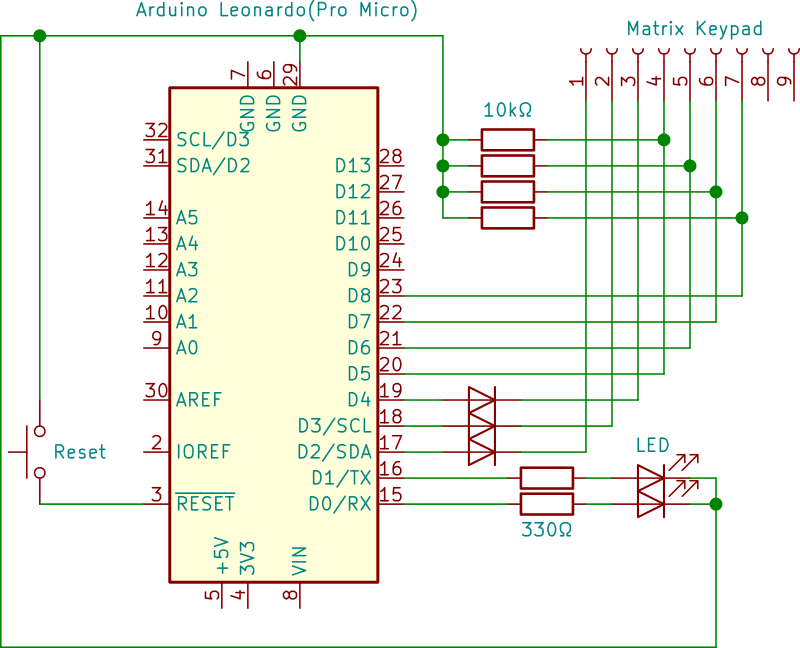

# DigitPad

## :question: これは何？
自作キーボードといえば、メカニカルキースイッチを完成済み基板にはんだ付けするのが定番ですが、構造がほぼ同じであるマトリクススイッチ（マトリクスキーパッド）を使ってもオリジナルキーボードを制作することができます。




ここではキーボードファームウェア「[QMK](https://qmk.fm/)」の派生プロジェクトである「[VIA](https://caniusevia.com/)」を用いた、パソコンからのキー配置の変更がいつでも自由に行えるプログラマブルテンキーを自作するためのサンプルプログラムを掲載しています。

## &#x26A1; ハードウェアの制作

これは回路の一例です。12キーでは7つの端子を割り当てていますが、16キーでは8つの端子を割り当てる必要があります。

## :gear: 開発環境の構築
VIAのファームウェアはQMKが基礎になっているので、開発環境の構築方法はQMKと全く同じです。Windows 10であれば、[MSYS2](https://www.msys2.org/)をインストールし、以下のコマンドをMSYS2のコンソールで実行します。

```
pacman --needed --noconfirm --disable-download-timeout -S git mingw-w64-x86_64-toolchain mingw-w64-x86_64-python3-pip
python -m pip install qmk
qmk setup
```

## :hammer: ソースコードのビルド・書き込み

ソースコードをビルドするには、[QMKファームウェア](https://github.com/qmk/qmk_firmware)のソースコードをGit Cloneし、「keyboards」フォルダーにDigitPadのソースコードをコピーしたうえで、MSYS2から以下のコマンドを実行します。

```
#cd qmk_firmware
qmk compile -kb digitpad -km via
```

ビルドされた結果はhexファイルとして保存されています。このhexファイルを[QML Toolbox](https://qmk.fm/toolbox/)を介して、マイコンに書き込んでください。

## :keyboard: キー配置の変更
[VIAのツールアプリ](https://github.com/the-via/releases/releases/)を使えば、ファームウェアを更新することなしに、いつでも配置を変更できます。アプリ上部のタブより「Design」を選択し、「Load Draft Definition」より「via.json」ファイルを読み込ませてください。